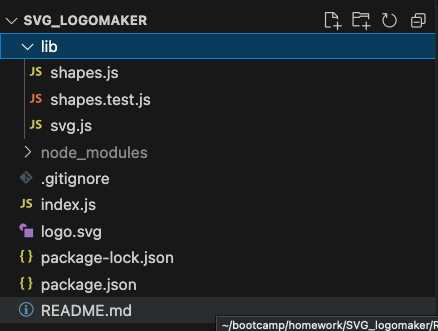
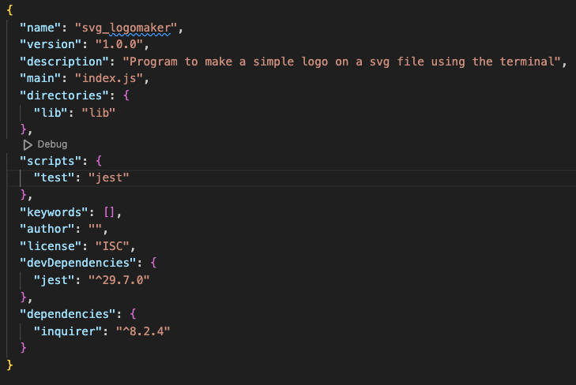
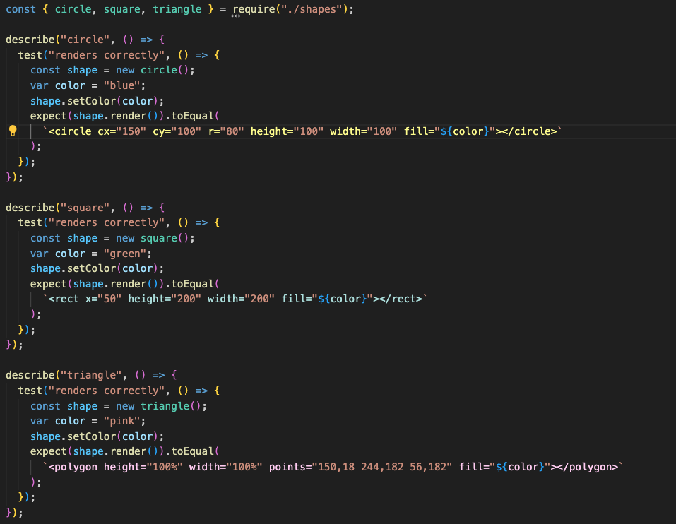

# SVG_logomaker

This Node.js command-line application allows you to create custom logos and save them as SVG files. Follow the instructions below to use the application:

## User Story

```md
AS a freelance web developer
I WANT to generate a simple logo for my projects
SO THAT I don't have to pay a graphic designer
```

## Acceptance Criteria

```md
GIVEN a command-line application that accepts user input
WHEN I am prompted for text
THEN I can enter up to three characters
WHEN I am prompted for the text color
THEN I can enter a color keyword (OR a hexadecimal number)
WHEN I am prompted for a shape
THEN I am presented with a list of shapes to choose from: circle, triangle, and square
WHEN I am prompted for the shape's color
THEN I can enter a color keyword (OR a hexadecimal number)
WHEN I have entered input for all the prompts
THEN an SVG file is created named `logo.svg`
AND the output text "Generated logo.svg" is printed in the command line
WHEN I open the `logo.svg` file in a browser
THEN I am shown a image that matches the criteria I entered
```

## Installation

1. Make sure you have Node.js installed on your machine.
2. Clone this repository to your local machine.

```

git clone <repository-url>

```

3. Navigate to the project directory.

```

cd SVG_logomaker

```

4. Install the necessary dependencies.

```

npm install

```

5. Run program

```
node index.js

```

## Instructions

1. **Text Input:** Enter the text you want to display in the logo.
2. **Color Selection:** Choose a color for your logo and shape by entering a color or hex number.
3. **Shape Selection\*:** Select a shape (e.g., circle, square, triangle) to use as the base of your logo.
4. **SVG File Creation:** After providing the necessary details, the application will generate an SVG file named **logo.svg** in the current directory.
5. **Video Tutorial** [Tutorial](https://drive.google.com/file/d/1ufoCxw5Rcqo1pQMPtDFEgy5pWy69DsYT/view)

## Screenshot

### File Path



### Packages



### Test Code



## Dependencies

- **inquirer:** Used for the command-line user interface and user prompts
- **jest:** Testing framework for writing unit and integration tests.

## Testing

Unit tests and integration tests can be written using Jest. Run the following command to execute tests:

```
npm test

```

## Additional Notes

- Feel free to customize the shapes, colors, and text options based on your requirements.
- For more complex logos or additional features, extend the functionality of the application as needed.
